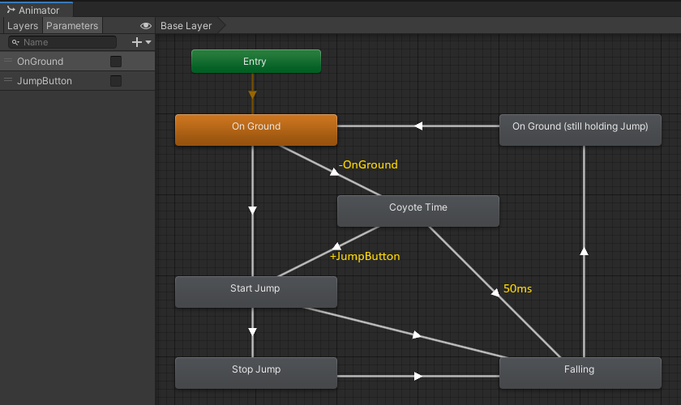

# 為何使用「狀態機」
避免程式碼義大利麵化。所有事物都可視為一種狀態機，並避免狀態與邏輯的耦合。

# 問題
當一個物件的內在狀態改變時，行為也會跟著改變。聽起來很抽象，但是這是在遊戲程式中非常常見的案例。考量以下狀況：

1. 輸入判定：在格鬥遊戲中，按下 *P鍵* 出拳，往往會依照角色目前正在前進、後退、直立、跳躍或蹲下等不同狀態，而出不同的拳。
2. 電腦操縱角色：機器人角色在看到玩家角色時，應該要考量角色的目前血量、武器種類、同伴數量等條件來做出不同的反應。
3. 遊戲流程控制：退出、暫停或儲存遊戲等功能的可執行與否，應該要依照目前遊戲是否正在載入、儲存、已經暫停、正在退出等狀態來決定。

上述這些常見情境的共通點，就是它們往往充滿各式各樣的特例。為了要實作相關邏輯來對應各種特例，你的程式碼很快就變成義大利麵了。

```csharp
if (Input.GetButton("Punch")) {
    if (player.velocity.z > 0) {
        ForwardPunch();
    } else if (player.velocity.z < 0) {
        Grapple();
    } else if (player.isJumping) {
        if (Input.GetAxis("Vertical") > 0) {
            UpwardPunch();
        } else {
            DownwardPunch();
        }
    } else if (player.isDucking) {
        UpwardPunch();
    } else {
        StandingPunch();
    }
}
```

當你才剛寫完上述程式碼，遊戲企劃又突然冒出對你說，在蹲下兩秒集氣後起身瞬間按下 *P鍵* 要可以使出必殺技「升龍臂」哦！還有還有，在跳躍滯空高度上升期間，連按 *P鍵* 兩下要可以丟出火球。

```
(╯°□°）╯︵ ┻━┻
```

# 解決方案
實際上，各種特例跟「狀態」是等價的。你程式碼中的每個條件分支，都是一個不同的狀態。在紙上先用筆把各種狀態畫下來，並用箭頭連接來代表狀態的改變。當你開始熟悉這樣的操作模式後，就會發現這種結構無所不在。


困難的地方在於，如何保證所有的狀態改變，都透過正確的條件、在正確的時機被觸發。但這件事跟實作 *P鍵* 要在各個狀態下執行什麼東西，是可以各自獨立的。我們切斷處理狀態改變部分，與執行行動部分的耦合，那就更容易在更乾淨的情境下來各別檢視他們。

現在我們知道問題的*輪廓*了，但要怎麼實作出來？

## Animators
上面那張圖，其實很像 [Unity 的 Animator 動畫控制系統](https://docs.unity3d.com/Manual/Animator.html)。而實際上，這就是我們現在要利用的，因為 Unity Animator 動畫控制器實際上能做到的事情遠遠不只單純播放動畫而已。讓我們來看看實例上怎麼運用吧。

# 範例
假設我們要實作一個 platformer 遊戲的輸入處理系統。我們希望支援這類遊戲的[常見操作](https://celestegame.fandom.com/wiki/Moves)，如：
1. 依據玩家按壓 *跳躍鍵* 的時間長短來決定跳躍高度。
2. 讓玩家角色在跑步離開平台地板後，有短暫的[起跳容錯時間](https://twitter.com/DavesInHisPants/status/1281189584462917632)。
3. 在空中能多跳一次的兩段跳能力。

## 跳躍控制器


一開始我們先建立一個新的動畫控制器。帶入的兩個布林值參數代表 *跳躍鍵* 是否正被按住（JumpButton），以及玩家角色目前是否腳踏實地（OnGround）。

我們狀態機中的第一個狀態，是 `On Ground`，只有在這狀態下玩家才能進行跳躍。我們還需要一個相對的狀態 `Falling`，以及在後面談到「狀態轉換」時會用到的其他幾個狀態。


先來看看 `On Ground` 狀態吧。當玩家按下 *跳躍鍵* 時，我們會開始一個跳躍的動作。當玩家放開 *跳躍鍵* 時，我們會依照一些遊戲邏輯設定來停止跳躍，讓玩家不會再上升太多高度。然後就會馬上轉換到 `Falling` 狀態，並不斷降落，直到玩家角色再次腳踏實地為止。

如果玩家落下瞬間，我們就馬上再從 `Falling` 轉換到 `On Ground` 狀態的話，便會發生玩家只要按住 *跳躍鍵*，就能像在彈簧墊上一樣不斷上下連續彈跳的情況，因為狀態機又會立刻轉換到 `Start Jump` 狀態。要把這個問題修掉，就得加入像 `On Ground (still holding Jump)` 這樣的中間狀態。

真沒想到，光處理跳躍就頗難的。我們的狀態機目前為止已經出現了不少邏輯，但也只能對應「可變跳躍高度」這項基本要素而已。可以想見這有多容易會產生義大利麵程式碼。

### 提供參數
要使我們的跳躍控制器能作動，還需要不斷傳入更新的參數值才行。幸好跟 Unity 動畫控制器的溝通還算簡單。
```csharp
public class JumpControllerParameterProvider : MonoBehaviour
{
    private bool onGround;

    void Update()
    {
        animator.SetBool("OnGround", onGround);
        animator.SetBool("JumpButton", Input.GetButton("Jump"));
    }

    void FixedUpdate()
    {
        onGround = Physics.SphereCast(rigidbody.position, radius, Vector3.down,
                              out RaycastHit hitInfo, distance, groundLayerMask);
    }
}  
```

### 傳送訊息
要讓這個跳躍控制器能真的對遊戲本體產生影響，我們得讓它可以和玩家角色相關程式溝通。可以透過繼承 `StateMachineBehaviour` 類別，來讓下面這段程式得以被加到狀態機中的任意狀態上。


為了簡單起見，這邊我們使用 [Unity 的 SendMessage](https://docs.unity3d.com/ScriptReference/Component.SendMessage.html) 系統。

```csharp
public class SendMessageState : StateMachineBehaviour
{
    public string onEnter, onExit;

    public override void OnStateEnter(Animator animator, AnimatorStateInfo stateInfo, int layerIndex)
    {
        if (!string.IsNullOrEmpty(onEnter)) animator.SendMessage(onEnter);
    }

    public override void OnStateExit(Animator animator, AnimatorStateInfo stateInfo, int layerIndex)
    {
        if (!string.IsNullOrEmpty(onExit)) animator.SendMessage(onExit);
    }
}
```

### 處理訊息
最後，我們需要另一段程式來接收動畫控制器所送的訊息，並帶入合適的遊戲邏輯。在目前的範例中，我們需要處理的是簡單的物理行為。

```csharp
public class JumpControllerMessageHandler : MonoBehaviour
{
    private bool startJump, stopJump;

    void StartJump() { startJump = true; }
    void StopJump()  { stopJump  = true; }

    void FixedUpdate()
    {
        if (startJump)
        {
            // 產生向上的力道來抵銷玩家角色任何向下的動量
            // 以讓玩家角色向上跳躍
            var downVelocity = Mathf.Min(rigidbody.velocity.y, 0);
            var deltaVelocity = new Vector3(0, jumpVelocity - downVelocity, 0);
            rigidbody.AddForce(deltaVelocity, ForceMode.VelocityChange);
            startJump = false;
        }
        if (stopJump)
        {
            // 產生剛好的力道來抵銷上升的動量
            var upVelocity = Mathf.Max(rigidbody.velocity.y, 0);
            var deltaVelocity = new Vector3(0, -upVelocity, 0);
            rigidbody.AddForce(deltaVelocity, ForceMode.VelocityChange);
            stopJump = false;
        }
    }
}
```

## 起跳容錯時間
幸運的是，把前面的架構建立起來就已經是最困難的部分了。要將[起跳容錯時間](https://celestegame.fandom.com/wiki/Moves#Coyote_Time)特性加入，只是很單純地新增一個狀態，並給予它非常短暫的 50 毫秒時限。這樣一來，就算玩家角色已經不是腳踏實地狀態，玩家還是可以在數個畫格時間內執行跳躍動作。這就是現在遊戲設計上常講的 [Game Feel](https://youtu.be/OfSpBoA6TWw?t=833)。



最令人意外的地方大概是，我們根本不需要為此修改任何程式碼。所有在 `Start Jump` 與 `Stop Jump` 狀態時該發生的事，還是照常運作。

## 兩段跳
兩段跳就是指我們在玩家下墜過程中，給予第二次跳躍的能力。這個第二次跳躍到底該怎麼運作？其實就跟第一次跳躍差不多。所以我們可以把幾個有關的狀態複製一份，然後加在 `Falling` 狀態的右邊，然後把它們連起來就好了。整體問題的*輪廓*仍然保持一樣。

在這邊我們需要顧慮的就只是，確保在我們執行第二次跳躍之前，*跳躍鍵* 已經是在放開的狀態，要不然類似前面講到的彈簧墊狀況又會出現。而又跟之前一樣的，解決方法就是加入一個 `Falling (still holding Jump)` 這樣的中間狀態。


從程式碼的角度來看，再一次地，我們什麼都不用改，一切照常運作。

現在我們可以真的體會到，將「狀態處理」與「跳躍物理實作」兩者耦合解開後的好處了。建立狀態機的結構是困難的部分，但好消息是，因為我們使用 Unity 動畫控制器來呈現狀態機，而動畫控制器非常容易除錯。只要按下播放鍵，Unity 就會顯示目前處於哪個狀態，然後跟遊戲內你看到的狀況一比較，通常馬上就可以看出錯誤出在哪裡。

## 參考資料

- [Don’t Re-invent Finite State Machines: How to Repurpose Unity’s Animator](https://medium.com/the-unity-developers-handbook/dont-re-invent-finite-state-machines-how-to-repurpose-unity-s-animator-7c6c421e5785) by Darren Tsung
- [Unite 2015 - Applied Mecanim : Character Animation and Combat State Machines](https://www.youtube.com/watch?v=Is9C4i4XyXk) by Aaron Horne
- [Advanced AI in Unity (made easy) - State Machine Behaviors](https://www.youtube.com/watch?v=dYi-i83sq5g) by Noa Calice
- [Game Programming Patterns - State](http://gameprogrammingpatterns.com/state.html) by Bob Nystrom
- [Tips and Tricks for good platforming games](http://www.davetech.co.uk/gamedevplatformer) by David Strachan

# 翻譯
- [台灣繁體中文 (zh-TW)](README-zh-TW.md)

如果你覺得這個工作坊有其價值，並通曉另一個語言，我們非常歡迎任何幫助工作坊內容進行翻譯的協助。把本儲存庫內容 clone 下來後，增加一份特定語言在地化的 README.md，例如 README-pt-BR.md，並送 PR 給我們。
